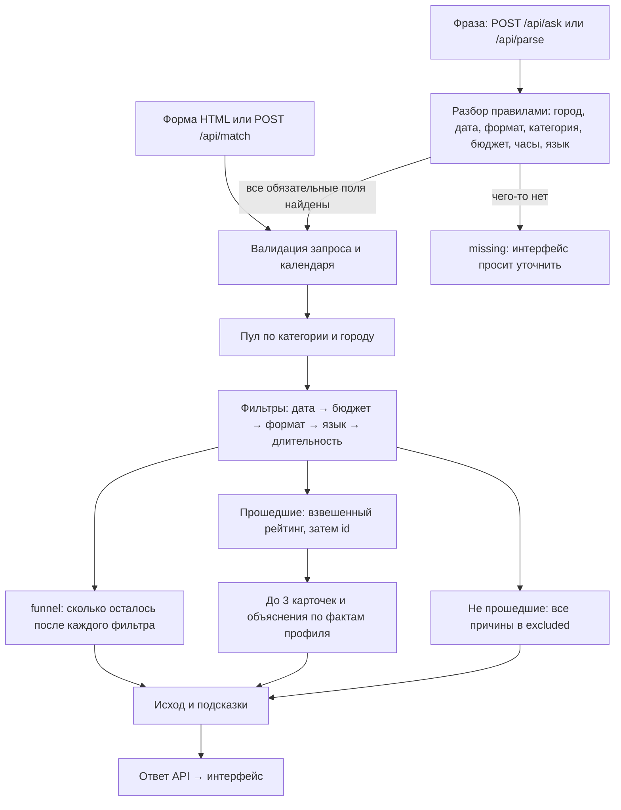

# Beyonder — умный подбор подрядчиков

До трёх event-подрядчиков под город, дату, формат и бюджет — и у каждого своё
объяснение, почему он подходит. Если подходящих нет, сервис говорит, что именно
помешало и что изменить. Запрос можно задать формой или одной фразой:
«Нужен ведущий на казахскую свадьбу 14 ноября в Алматы, бюджет до 800 тысяч, часов на 6».

> [!TIP]
> **Проверка за 2 минуты (Windows PowerShell):**
> ```powershell
> git clone https://github.com/BAITC-Hacks/hack-774a9321-beyonder.git; cd hack-774a9321-beyonder
> py -3 -m venv .venv; .\.venv\Scripts\python.exe -m pip install -r requirements.txt
> .\.venv\Scripts\python.exe -m uvicorn app.main:app --host 127.0.0.1 --port 8000
> ```
> Откройте http://localhost:8000. Во втором терминале: `.\.venv\Scripts\python.exe scripts/demo.py`
> → `PASS: 7 ответов, 0 ошибок`. Команды для macOS/Linux — ниже.

## Описание решения и назначение

Проект трека 06 «Креативные индустрии», задача «Умный подбор подрядчиков» (#79-lite).
Заказчик задаёт город, дату, формат мероприятия, категорию и бюджет в тенге;
при необходимости — длительность и язык. Сервис возвращает до трёх подрядчиков
с индивидуальным объяснением выбора и показывает причины отказа остальным.
Если вариантов мало или нет, интерфейс объясняет, какое условие мешает подбору.

Каталог организаторов: `data/hackathon-dataset-anonymized.csv`, 66 профилей.
Имена анонимизированы. Признак `synthetic` отмечает синтетические профили;
`price_imputed` и `city_imputed` — оценочную цену и восстановленный город.
Это демонстрационный подбор, а не бронирование: цена указана «от», доступность
берётся из предоставленного календаря, а не проверяется у реального подрядчика.
Календарь: **23 сентября — 31 декабря 2026 включительно**.

## Архитектура



- `app/data.py` загружает CSV; необязательный `data/synthetic-extra.csv` добавляет
  профили команды, если такой файл присутствует. После изменения CSV нужен перезапуск.
- `app/matcher.py` проверяет жёсткие ограничения. Сохраняются **все** причины
  исключения: кандидат может одновременно быть занят и превышать бюджет.
  Сумма счётчиков причин поэтому может превышать размер пула.
- Рейтинг прошедших: `0.40 × budget + 0.30 × relevance + 0.15 × hours +
  0.10 × language + 0.05 × data_quality`. `budget` — запас бюджета относительно
  цены; `relevance` — маркеры формата в описании и узкая специализация; `hours` —
  запас длительности; `language` — соответствие языку или разнообразие языков;
  `data_quality` снижает оценку при восстановленных цене/городе.
  Итог округляется до 6 знаков и сортируется по убыванию; равенство разрешается
  по `id` по возрастанию. Выдаются первые три. Рейтинг не является вероятностью.
- Объяснения используют описание, цену, формат, язык, длительность и занятость.
  Шаблонный режим воспроизводим и не требует внешнего API.
- `app/main.py` предоставляет API и страницу `static/index.html`. БД, сборщик
  фронтенда и Node.js для запуска не нужны.

| Исход | Значение |
| --- | --- |
| `found` | Найдено не менее 3 подходящих, показаны 3 лучших |
| `partial` | Подходят 1–2 подрядчика |
| `no_category_in_city` | В городе вообще нет выбранной категории |
| `none_match` | Категория есть, но все кандидаты исключены по условиям |
| `invalid_request` | Дата вне известного календаря |

Некорректные типы полей, неположительный бюджет и неизвестные формат/язык дают
HTTP 422 с `detail`. Это отдельный ответ валидации, а не `none_match`.

Кроме карточек, ответ `/api/match` содержит `funnel` — последовательное сужение пула
(например, «8 в категории и городе → 4 свободны 10 октября → 4 в бюджете → 3 берут формат»),
`excluded` — все причины отказа по каждому кандидату и `hints` — что изменить, чтобы нашлось
(«ближайший свободный день…», «при бюджете от…»). У карточки `explanation_source` показывает,
как собрано объяснение: сейчас `template` — по правилам из фактов профиля.

### Запрос свободным текстом

| Метод | Вход | Выход |
| --- | --- | --- |
| `POST /api/parse` | `{"text": "..."}` | `params` (поля запроса, `null` если не найдено), `found` (поле, значение, фрагмент текста), `missing`, `notes`, `source` |
| `POST /api/ask` | `{"text": "..."}` | `parsed` (как выше) и `result` — ответ `/api/match` или `null`, если не хватает обязательных полей |

Разбор выполняется правилами (`"source": "rules"`) без внешних API, поэтому он
детерминирован. Пример и фактический результат — в [docs/DEMO.md](docs/DEMO.md#8-запрос-свободным-текстом).

## Используемые технологии

Python 3.10+, FastAPI, Pydantic, Uvicorn; HTML, CSS и JavaScript без фреймворков.
Данные — CSV; API — JSON. Демонстрационный клиент использует стандартную
библиотеку Python (`urllib`, `json`, `argparse`) без дополнительных пакетов.

## Инструкции по установке

```bash
git clone https://github.com/BAITC-Hacks/hack-774a9321-beyonder.git
cd hack-774a9321-beyonder
```

Windows PowerShell (установленный Python 3.10+ доступен как `py`):

```powershell
py -3 -m venv .venv
.\.venv\Scripts\python.exe -m pip install -r requirements.txt
```

macOS / Linux:

```bash
python3 -m venv .venv
.venv/bin/python -m pip install -r requirements.txt
```

Активация окружения не требуется. Команды выполняются из корня репозитория.

## Инструкции по запуску

Windows PowerShell:

```powershell
.\.venv\Scripts\python.exe -m uvicorn app.main:app --host 127.0.0.1 --port 8000
```

macOS / Linux:

```bash
.venv/bin/python -m uvicorn app.main:app --host 127.0.0.1 --port 8000
```

Открыть [интерфейс](http://localhost:8000), [Swagger](http://localhost:8000/docs)
или [метаданные](http://localhost:8000/api/meta). Остановка — `Ctrl+C`.
Если порт занят, используйте `--port 8001` и соответствующий адрес; демо принимает
`--base-url http://localhost:8001`. Не открывайте HTML через `file://`: ему нужен API.

## Зависимости

Прямые зависимости в `requirements.txt`: `fastapi>=0.110`, `uvicorn>=0.29`;
Pydantic и Starlette устанавливаются транзитивно. Проверенные версии и ответы
приведены в [docs/DEMO.md](docs/DEMO.md). Текущий файл задаёт нижние границы,
а не точный lock-файл. Интернет нужен для установки; затем подбор работает локально.

## Переменные окружения

| Переменная | Обязательна | Назначение |
| --- | --- | --- |
| `OPENAI_API_KEY` | Нет | Ключ для опционального LLM-слоя объяснений после его подключения основным разработчиком. В проверенном каркасе `fa28e0c` ключ не читается: все объяснения шаблонные. Без ключа основной сценарий работает. |

Не включайте ключ в Git или клиентский HTML. Сам по себе `.env` в текущем каркасе
не загружается. LLM не требуется для фильтрации и рейтинга.
`funnel` и `cards[].explanation_source` — опциональные расширения ответа;
их отсутствие допустимо. UI не должен выдавать шаблонное объяснение за LLM.

## Порядок проверки основного сценария

1. Запустить сервер и открыть `http://localhost:8000`.
2. Выбрать **Алматы / 10.10.2026 / свадьба / Фотограф / 800000 ₸**.
   Длительность оставить пустой, язык — любой. Нажать «Подобрать».
3. Ожидается `found`: Леорио Паради, Нобара Кугисаки, Альфонс Элрик — в этом порядке.
   У каждого своё объяснение; исключённые кандидаты имеют причины.
4. В поле «Другая дата» указать **12.12.2026** и нажать «Сравнить с другой датой»:
   подборки отображаются рядом (на узком экране — друг под другом).
   На вторую дату — `partial`, одна карточка — Сацуки
   Кусакабэ. Трое из октябрьской выдачи исключены с причиной «занят 12 декабря».
   Подсветка основывается на причинах в `excluded`, а не просто на разнице топ-3.
5. Прогнать все сценарии в другом терминале, пока сервер работает:

```powershell
.\.venv\Scripts\python.exe scripts/demo.py
```

На macOS/Linux: `.venv/bin/python scripts/demo.py`. Успех — `PASS: 7 ответов, 0 ошибок`
и код завершения 0; несовпадение исходов или недоступность API — ненулевой код.
Клиент печатает запросы, сообщения, карточки, объяснения и причины исключения.
Подробные входы, ID и фактические ответы: [docs/DEMO.md](docs/DEMO.md).

6. Запрос свободным текстом (сценарий `nl` в `scripts/demo.py`) — вручную через API:

```powershell
Invoke-RestMethod http://localhost:8000/api/ask -Method Post -ContentType 'application/json; charset=utf-8' `
  -Body ([Text.Encoding]::UTF8.GetBytes('{"text": "Нужен ведущий на казахскую свадьбу 14 ноября в Алматы, бюджет до 800 тысяч, часов на 6"}')) |
  ConvertTo-Json -Depth 6
```

Ожидается: `parsed.missing` пуст, распознаны город, дата 2026-11-14, свадьба, Ведущий,
800 000 ₸ и 6 ч; `result.outcome` = `partial`, карточка — Мицури Канроджи (HK-44923).

7. Автотесты требований (Definition of Done): детерминизм порядка, занятые никогда не показываются,
разная выдача на две даты с причиной «занят», различимые исходы, редкая категория, границы календаря,
объяснения различимы без имён, последовательная воронка, HTTP-контракт и разбор свободного текста.

```powershell
.\.venv\Scripts\python.exe -m pip install pytest
.\.venv\Scripts\python.exe -m pytest -q
```

Ожидается: все тесты проходят (на момент проверки — `27 passed`).
