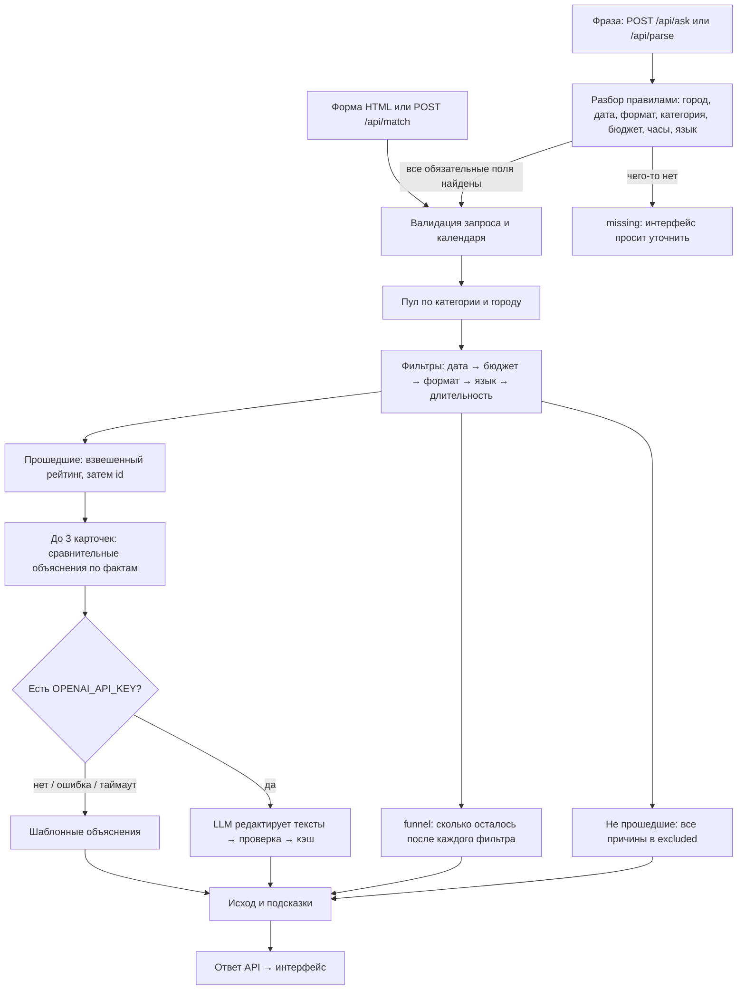

# Beyonder — умный подбор подрядчиков

До трёх event-подрядчиков под город, дату, формат и бюджет — и у каждого своё
объяснение, почему он подходит. Если подходящих нет, сервис говорит, что именно
помешало и что изменить. Запрос можно задать формой или одной фразой:
«Нужен ведущий на казахскую свадьбу 14 ноября в Алматы, бюджет до 800 тысяч, часов на 6».

> [!TIP]
> **Проверка за 2 минуты (Windows PowerShell):**
> ```powershell
> git clone https://github.com/BAITC-Hacks/hack-774a9321-beyonder.git; cd hack-774a9321-beyonder
> py -3 -m venv .venv; .\.venv\Scripts\python.exe -m pip install -r requirements.txt
> .\.venv\Scripts\python.exe -m uvicorn app.main:app --host 127.0.0.1 --port 8000
> ```
> Откройте http://localhost:8000. Во втором терминале: `.\.venv\Scripts\python.exe scripts/demo.py`
> → `PASS: 7 ответов, 0 ошибок`. Команды для macOS/Linux — ниже.

## Описание решения и назначение

Проект трека 06 «Креативные индустрии», задача «Умный подбор подрядчиков» (#79-lite).
Заказчик задаёт город, дату, формат мероприятия, категорию и бюджет в тенге;
при необходимости — длительность и язык. Сервис возвращает до трёх подрядчиков
с индивидуальным объяснением выбора и показывает причины отказа остальным.
Если вариантов мало или нет, интерфейс объясняет, какое условие мешает подбору,
и подсказывает, что можно изменить (ближайшая свободная дата, нужный бюджет).
Запрос можно ввести и свободным текстом: «Нужен ведущий на свадьбу 14 ноября в Алматы,
бюджет до 800 тысяч, часов на 6».

Каталог организаторов: `data/hackathon-dataset-anonymized.csv`, 66 профилей.
Имена анонимизированы. Признак `synthetic` отмечает синтетические профили;
`price_imputed` и `city_imputed` — оценочную цену и восстановленный город.
Это демонстрационный подбор, а не бронирование: цена указана «от», доступность
берётся из предоставленного календаря, а не проверяется у реального подрядчика.
Календарь: **23 сентября — 31 декабря 2026 включительно**.

## Архитектура



- `app/data.py` загружает CSV; необязательный `data/synthetic-extra.csv` добавляет
  профили команды (`synthetic=true`, поле `source` отличает их от данных организаторов).
- `app/matcher.py` проверяет жёсткие ограничения. Сохраняются **все** причины
  исключения: кандидат может одновременно быть занят и превышать бюджет,
  поэтому сумма счётчиков причин может превышать размер пула. Поле `funnel`
  показывает последовательную воронку: пул → свободны на дату → бюджет → формат → язык → длительность.
- Рейтинг прошедших: `0.40 × budget + 0.30 × relevance + 0.15 × hours +
  0.10 × language + 0.05 × data_quality`. `budget` — запас бюджета относительно
  цены; `relevance` — маркеры формата в описании и узкая специализация; `hours` —
  запас длительности; `language` — соответствие языку или разнообразие языков;
  `data_quality` снижает оценку при восстановленных цене/городе.
  Итог округляется до 6 знаков и сортируется по убыванию; равенство разрешается
  по `id` по возрастанию. Выдаются первые три.
- Объяснения сравнительные: код считает, чем карточка отличается от остальных в подборке
  (цена, часы на площадке, языки, форматы, фрагмент описания, занятость категории на дату).
  Поэтому карточки одного запроса нельзя перепутать даже без имён.
- `app/explain_llm.py` — необязательная редактура объяснений через OpenAI (см. ниже).
- `app/nl_parse.py` — разбор запроса свободным текстом по правилам, без сети.
- `app/main.py` предоставляет API и страницу `static/index.html`. БД, сборщик
  фронтенда и Node.js не нужны.

| Исход | Значение |
| --- | --- |
| `found` | Найдено не менее 3 подходящих, показаны 3 лучших |
| `partial` | Подходят 1–2 подрядчика, в `message` — почему меньше трёх |
| `no_category_in_city` | В городе вообще нет выбранной категории |
| `none_match` | Категория есть, но все кандидаты исключены по условиям |
| `invalid_request` | Дата вне известного календаря |

Некорректные типы полей, неположительный бюджет и неизвестные формат/язык дают
HTTP 422 с `detail`. Это отдельный ответ валидации, а не `none_match`.

Кроме карточек, ответ `/api/match` содержит `funnel` — последовательное сужение пула
(например, «8 в категории и городе → 4 свободны 10 октября → 4 в бюджете → 3 берут формат»),
`excluded` — все причины отказа по каждому кандидату и `hints` — что изменить, чтобы нашлось
(«ближайший свободный день…», «при бюджете от…»). У карточки `explanation_source` показывает,
как собрано объяснение: `template` — по правилам из фактов профиля, `llm` — отредактировано моделью
после проверки фактов.

### API

| Метод | Вход | Выход |
| --- | --- | --- |
| `GET /api/meta` | — | Допустимые города, категории, форматы, языки и границы календаря |
| `POST /api/match` | город, дата, формат, категория, бюджет, опц. часы и язык | `outcome`, `message`, `cards`, `excluded`, `hints`, `funnel` |
| `POST /api/parse` | `{"text": "..."}` | `params` (поля запроса, `null` если не найдено), `found` (поле, значение, фрагмент текста), `missing`, `notes`, `source` |
| `POST /api/ask` | `{"text": "..."}` | `parsed` (как выше) и `result` — ответ `/api/match` или `null`, если не хватает обязательных полей |

Интерактивная документация: `http://localhost:8000/docs`.

## Используемые технологии

Python 3.10+, FastAPI, Pydantic, Uvicorn; OpenAI Python SDK (необязательный слой
объяснений); pytest и httpx для тестов; HTML, CSS и JavaScript без фреймворков.
Данные — CSV; API — JSON.

## Инструкции по установке

```bash
git clone https://github.com/BAITC-Hacks/hack-774a9321-beyonder.git
cd hack-774a9321-beyonder
```

Windows PowerShell (установленный Python 3.10+ доступен как `py`):

```powershell
py -3 -m venv .venv
.\.venv\Scripts\python.exe -m pip install -r requirements.txt
```

macOS / Linux:

```bash
python3 -m venv .venv
.venv/bin/python -m pip install -r requirements.txt
```

Активация окружения не требуется. Команды выполняются из корня репозитория.

## Инструкции по запуску

Windows PowerShell:

```powershell
.\.venv\Scripts\python.exe -m uvicorn app.main:app --host 127.0.0.1 --port 8000
```

macOS / Linux:

```bash
.venv/bin/python -m uvicorn app.main:app --host 127.0.0.1 --port 8000
```

Открыть [интерфейс](http://localhost:8000), [Swagger](http://localhost:8000/docs)
или [метаданные](http://localhost:8000/api/meta). Остановка — `Ctrl+C`.
Если порт занят, используйте `--port 8001`; демо принимает `--base-url http://localhost:8001`.
Не открывайте HTML через `file://`: ему нужен API. API-ключ для запуска не требуется.

С LLM-редактурой объяснений: скопируйте `.env.example` в `.env`, впишите ключ и запустите
с `--env-file .env`:

```powershell
.\.venv\Scripts\python.exe -m uvicorn app.main:app --host 127.0.0.1 --port 8000 --env-file .env
```

## Зависимости

Все зависимости перечислены в `requirements.txt`: `fastapi`, `uvicorn` — сервис;
`openai` — необязательный LLM-слой (импортируется только при обращении к модели);
`python-dotenv` — чтение `.env` через `--env-file`; `pytest`, `httpx` — тесты.
Интернет нужен для установки; затем подбор работает локально, сеть нужна только LLM-слою.

## Переменные окружения

Все переменные необязательны: без них сервис полностью работает на шаблонных объяснениях.

| Переменная | По умолчанию | Назначение |
| --- | --- | --- |
| `OPENAI_API_KEY` | пусто | Ключ OpenAI для редактуры объяснений. Берётся на platform.openai.com → API keys |
| `OPENAI_MODEL` | `gpt-4o-mini` | Модель с поддержкой `temperature=0` и Structured Outputs |
| `EXPLANATIONS_LLM_ENABLED` | `true` | `false` полностью выключает обращения к API |

Ключ хранится только в окружении или локальном `.env`, который исключён из Git.
Не включайте ключ в Git или клиентский HTML.

### Как устроен LLM-слой объяснений

Один вызов обрабатывает все карточки запроса. Модель получает только условия запроса,
проверяемые факты, релевантные цитаты и уже рассчитанные кодом сравнения; она возвращает
JSON с массивом объяснений и не влияет на отбор или порядок. Ответ проверяется:
1–2 предложения, стоп-лист общих фраз, наличие числового или цитатного основания,
отсутствие чисел и цитат, которых нет во входе, различимость карточек без имён.
При нарушении допускается одна попытка исправления с перечнем ошибок; на обе попытки
вместе выделено 6 секунд. Нет ключа, ошибка, таймаут или повторный невалидный ответ —
используются шаблоны. В каждой карточке есть `explanation_source`: `llm` либо `template`.

Кэш — `.cache/explanations.json`, ключ SHA-256 от запроса, упорядоченных ID и версии
промпта: одинаковый запрос всегда возвращает тот же текст. Чтобы заново запросить LLM
после временной ошибки, удалите файл и перезапустите приложение. Для демонстрации
используйте один процесс uvicorn.

### Запрос свободным текстом

`POST /api/parse` распознаёт город, дату («14 ноября», «14.11», «2026-11-14»), формат,
категорию (включая синонимы: «тамада», «фотобудка», «живая музыка»), бюджет («800 тысяч»,
«1,5 млн», «600к», «400 000 ₸»), длительность и язык. Для каждого поля возвращается фрагмент
текста, из которого оно взято (`found`); нераспознанные обязательные поля — в `missing`;
вторая категория в тексте и дата вне календаря объясняются в `notes`. Разбор детерминирован
и работает без сети.

## Порядок проверки основного сценария

1. Запустить сервер и открыть `http://localhost:8000`.
2. Выбрать **Алматы / 10.10.2026 / свадьба / Фотограф / 800000 ₸**.
   Длительность оставить пустой, язык — любой. Нажать «Подобрать».
3. Ожидается `found`: три карточки, у каждой своё объяснение со сравнением с остальными;
   исключённые кандидаты показаны с причинами.
4. В поле «Другая дата» указать **12.12.2026** и нажать «Сравнить с другой датой»:
   подборки отображаются рядом, кандидаты из октябрьской выдачи подсвечены как исключённые
   с причиной «занят 12 декабря» (подсветка строится по причинам в `excluded`).
5. Запрос свободным текстом: в поле «Опишите мероприятие своими словами» ввести
   «Нужен ведущий на казахскую свадьбу 14 ноября в Алматы, бюджет до 800 тысяч, часов на 6»
   и нажать «Разобрать». Форма заполняется, под полем видно, из какого фрагмента текста взято
   каждое значение, и подсказка про язык «казахский» и формат «той». То же через API
   (сценарий `nl` в `scripts/demo.py`):

```powershell
Invoke-RestMethod http://localhost:8000/api/ask -Method Post -ContentType 'application/json; charset=utf-8' `
  -Body ([Text.Encoding]::UTF8.GetBytes('{"text": "Нужен ведущий на казахскую свадьбу 14 ноября в Алматы, бюджет до 800 тысяч, часов на 6"}')) |
  ConvertTo-Json -Depth 6
```

Ожидается: `parsed.missing` пуст, распознаны город, дата 2026-11-14, свадьба, Ведущий,
800 000 ₸ и 6 ч; `result.outcome` = `partial`, карточка — Мицури Канроджи (HK-44923).

6. Прогнать все демо-сценарии в другом терминале, пока сервер работает:

```powershell
.\.venv\Scripts\python.exe scripts/demo.py
```

На macOS/Linux: `.venv/bin/python scripts/demo.py`. Успех — `PASS: 7 ответов, 0 ошибок`
и код завершения 0; несовпадение исходов или недоступность API — ненулевой код.
Клиент печатает запросы, сообщения, карточки, объяснения и причины исключения.
Подробные входы, ID и фактические ответы: [docs/DEMO.md](docs/DEMO.md).

7. Автотесты требований (Definition of Done) — без сети, LLM-тесты подменяют SDK:
детерминизм порядка, занятые никогда не показываются, разная выдача на две даты с причиной
«занят», различимые исходы, редкая категория, границы календаря, объяснения различимы без имён,
последовательная воронка, HTTP-контракт, LLM-слой (кэш, проверка, таймаут) и разбор свободного текста.

```powershell
.\.venv\Scripts\python.exe -m pytest -q
```

Ожидается: все тесты проходят (`pytest` уже входит в `requirements.txt`).

## Ограничения

Календарь известен только с 23.09 по 31.12.2026; цена «от» не является окончательной
сметой. Бронирование и уведомления не реализованы. Качество перефразирования зависит от
модели; локальная проверка фактов не заменяет полную семантическую проверку текста.
У полностью одинаковых по условиям профилей отличия в услугах не выдумываются.
