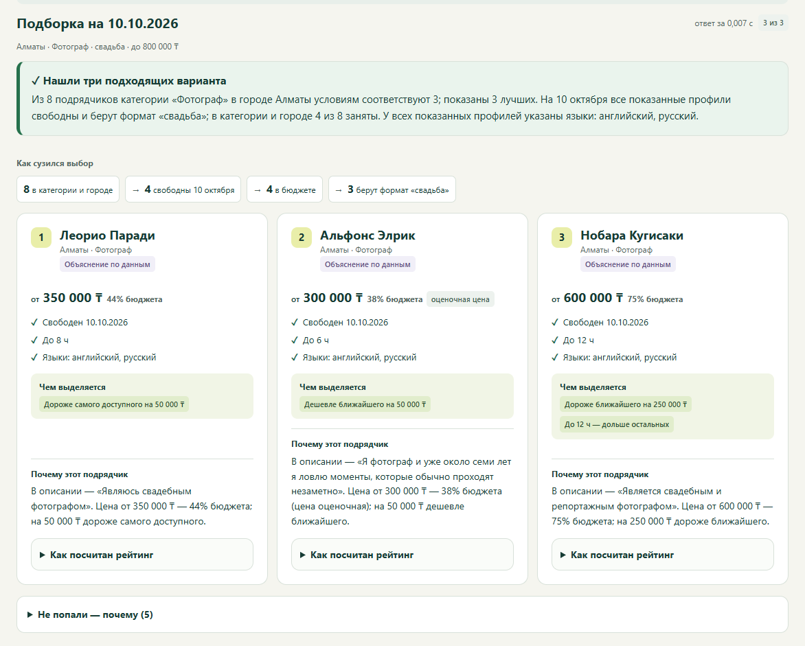
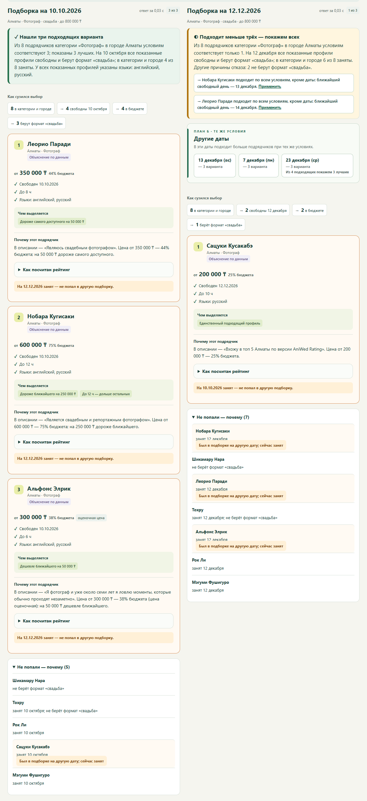
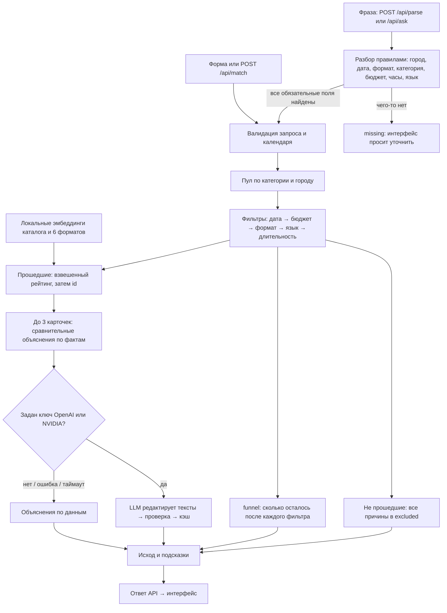

<div align="center">

# Beyonder

### Подбор event-подрядчиков, который объясняет свой выбор

До трёх вариантов под город, дату, формат и бюджет — и у каждого своя причина.<br>
Если никто не подходит, сервис говорит, что помешало и что изменить.

[Быстрый старт](#быстрый-старт) · [Как проверить](#порядок-проверки-основного-сценария) · [Архитектура](#архитектура) · [API](#api) · [Сценарии и ответы](docs/DEMO.md)

   



<sub>Кнопка «Фотографы в Алматы»: воронка отбора и три карточки с объяснениями. Запуск без ключа API.</sub>

</div>

> [!NOTE]
> **Ключ API не нужен.** Без ключа работают подбор, «План Б», разбор фразы и смысловая оценка описаний:
> эмбеддинги для каталога и шести форматов уже сохранены в `data/embeddings.json` и сравниваются локально.
> Объяснения собираются по данным каталога (метка «Объяснение по данным»); результаты ниже проверены без ключа.
> С ключом OpenAI или NVIDIA модель дополнительно редактирует текст объяснений — это [необязательно](#необязательно-ai-объяснения-с-ключом).

## Описание решения и назначение

Трек 06 «Креативные индустрии», задача «Умный подбор подрядчиков» (#79-lite). Заказчик уже выбрал тип
мероприятия и видит каталог своего города; ему нужно выбрать, а не листать длинный список.
Он задаёт город, дату, формат, категорию и бюджет в тенге (по желанию — длительность и язык) — формой или одной фразой.

| Что делает сервис | Как это выглядит |
| --- | --- |
| **Три карточки, а не список** | До трёх подрядчиков; у каждого «Чем выделяется» и «Почему этот подрядчик» — карточки не перепутать даже без имён |
| **Честное «нет»** | Воронка «8 в категории → 4 свободны → 3 в бюджете» и причины отказа по каждому кандидату |
| **Подсказки с действием** | «ближайший свободный день — 13 декабря», «при бюджете от 300 000 ₸» → кнопка «Применить» |
| **План Б** | Ближайшие даты, где подборка больше, — или прямое «смена даты не поможет» |
| **Запрос одной фразой** | «Нужен тамада на той 20 ноября в Астане…» → форма, у каждого поля — фрагмент текста, из которого оно взято |
| **Смысловая оценка без ключа** | Заранее рассчитанные векторы предложений сравниваются с одним из шести форматов мероприятия локально; порядок остаётся воспроизводимым |
| **Прозрачный рейтинг** | «Как посчитан рейтинг»: оценки бюджета, описания, часов, языка и качества данных и их веса |

Каталог организаторов — `data/hackathon-dataset-anonymized.csv`: 66 анонимизированных профилей, 13 из них синтетические
(помечены в выдаче), у части профилей оценочная цена или восстановленный город (тоже помечены). Календарь занятости —
**23 сентября — 31 декабря 2026**. Это подбор, а не бронирование: цены «от», доступность — по календарю каталога.

## Быстрый старт

Нужны Git и Python 3.10 или новее. Ключ API не нужен.

> ✅ **Проверено запуском с нуля 23.09.2026** (Windows 11): чистый `git clone` → `venv` → установка зависимостей за 56 с → `scripts/demo.py` — `PASS: 8 ответов, 0 ошибок`, `pytest` — все тесты проходят, аудит — «Нарушений не найдено». Docker: контейнер `healthy`, `demo.py` 8/8, тесты внутри контейнера (Linux, Python 3.12) проходят.

### Инструкции по установке

**Windows PowerShell**

```powershell
git clone https://github.com/BAITC-Hacks/hack-774a9321-beyonder.git
cd hack-774a9321-beyonder
py -3 -m venv .venv
.\.venv\Scripts\python.exe -m pip install -r requirements.txt
```

**macOS / Linux**

```bash
git clone https://github.com/BAITC-Hacks/hack-774a9321-beyonder.git
cd hack-774a9321-beyonder
python3 -m venv .venv
.venv/bin/python -m pip install -r requirements.txt
```

<sub>Если в Windows нет команды `py`, используйте `python -m venv .venv`. На macOS проверьте `python3 --version`.
Активировать окружение не нужно, все команды выполняются из корня репозитория.</sub>

### Инструкции по запуску

```powershell
.\.venv\Scripts\python.exe -m uvicorn app.main:app --host 127.0.0.1 --port 8000
```

```bash
.venv/bin/python -m uvicorn app.main:app --host 127.0.0.1 --port 8000
```

Откройте **http://localhost:8000**. Там же — [Swagger](http://localhost:8000/docs) и [метаданные каталога](http://localhost:8000/api/meta).
Остановка — `Ctrl+C`. Если порт занят, используйте `--port 8001`. HTML через `file://` не откроется: странице нужен API.

### Альтернатива: Docker

Если установлен Docker с Compose, из корня репозитория запустите одну команду (одинакова в PowerShell, macOS и Linux):

```bash
docker compose up --build
```

Откройте **http://localhost:8000**. Ключ API не нужен. Для первой сборки нужна сеть, чтобы загрузить базовый образ и Python-зависимости; каталог и эмбеддинги уже входят в собранный образ. Остановка — `Ctrl+C`, затем `docker compose down`.

## Порядок проверки основного сценария

**В браузере** — всё проверяется кнопками-сценариями над формой:

| # | Что сделать | Что вы увидите |
| :-: | --- | --- |
| 1 | Нажать **«Фотографы в Алматы»** | Исход «Нашли три подходящих варианта». Три карточки с одинаковой структурой фактов (цена и % бюджета, свободен, часы, языки), своей строкой «Чем выделяется» и своим объяснением. «Как посчитан рейтинг» показывает оценки факторов и веса; рядом — фактическое время ответа. Метка «Объяснение по данным» |
| 2 | Нажать **«Редкая категория»**, затем **«Нет в городе»** | Флористы: один вариант и объяснение, почему меньше трёх. Лайв-бэнд в Астане: «В этом городе нет такой категории» |
| 3 | Нажать **«Сравнить даты»** | Подборки на 10 октября и 12 декабря рядом. Октябрьская тройка отмечена «занят 12 декабря»; под декабрьской — «Другие даты»: 13 декабря (вс) и 7 декабря (пн), по 3 варианта |
| 4 | Вставить фразу ниже в поле «Опишите мероприятие своими словами» → **«Разобрать»** → **«Подобрать подрядчиков»** | Форма заполнена, у каждого поля — фрагмент текста; совет выбрать язык «казахский» или формат «той». Подбор сам не запускается. После нажатия — один вариант: Мицури Канроджи |
| 5 | Под результатом нажать **«Применить»** у подсказки | Дата или бюджет подставлены, подбор повторён |

Фраза для шага 4:

```text
Нужен ведущий на казахскую свадьбу 14 ноября в Алматы, бюджет до 800 тысяч, часов на 6
```

<details>
<summary><b>Скриншот: сравнение дат и «План Б»</b></summary>
<br>

</details>

**В терминале** — во втором окне, пока сервер работает:

```powershell
.\.venv\Scripts\python.exe scripts/demo.py
.\.venv\Scripts\python.exe -m pytest -q
.\.venv\Scripts\python.exe scripts/audit_explanations.py --strict
```

```bash
.venv/bin/python scripts/demo.py
.venv/bin/python -m pytest -q
.venv/bin/python scripts/audit_explanations.py --strict
```

| Команда | Ожидается |
| --- | --- |
| `scripts/demo.py` | `PASS: 8 ответов, 0 ошибок`, код 0. Восемь сценариев через настоящий HTTP; один сценарий — `--case dense` (также `rare`, `no-category`, `none`, `december`, `invalid`, `nl`, `plan-b`). Входы и ответы — в [docs/DEMO.md](docs/DEMO.md) |
| `pytest -q` | Все тесты проходят. Без сети; LLM-тесты подменяют SDK |
| `audit_explanations.py --strict` | `Запросов: 7290 … Нарушений не найдено.` — вся сетка «город × категория × формат × дата × бюджет»: карточки одного запроса не совпадают ни целиком, ни первым предложением, ни без имени и номера профиля; нет общих фраз; не больше двух предложений |

<sub>Если сервер запущен на другом порту: `scripts/demo.py --base-url http://127.0.0.1:8001`.</sub>

### Соответствие Definition of Done

| Требование задачи | Где увидеть | Автоматическая проверка |
| --- | --- | --- |
| До 3 карточек: имя, категория, город, цена, 1–2 предложения объяснения | Шаг 1 | `demo.py` `dense`, `tests/test_dod.py` |
| Объяснения не взаимозаменяемы: без имён не перепутать | Шаг 1 | `test_explanations_remain_distinct_without_names`, аудит: 7290 запросов, 0 нарушений |
| Занятый на дату подрядчик не попадает в выдачу | «Не попали — почему» | `test_busy_contractors_never_shown` |
| Тот же запрос — тот же порядок | Повторить шаг 1 | `test_determinism_and_card_contract` |
| Две даты — разная выдача, видно, что дело в занятости | Шаг 3 | `test_two_dates_change_results_with_busy_reason`, `demo.py` `december` |
| Меньше трёх — показать, сколько есть и почему | Шаг 2 | `test_rare_category_explains_partial_result`, `demo.py` `rare` |
| Три исхода различимы | Шаги 1–2, бюджет 1 ₸ | `test_outcomes`, `demo.py` `no-category`, `none` |
| Пустой результат объяснён словами | Бюджет 1 ₸: причины и «при бюджете от…» | `demo.py` `none` |
| Время ответа и ограничение ожидания LLM | Фактическое время над подборкой; для LLM установлен лимит 6 с | `tests/test_explain_llm.py` |
| Команда может объяснить пайплайн | [Архитектура](#архитектура), «Как посчитан рейтинг» | `test_funnel_is_sequential_and_preserves_rejection_reasons` |

## Архитектура



| Модуль | Что делает |
| --- | --- |
| `app/matcher.py` | Жёсткие фильтры, рейтинг, сравнительные объяснения, воронка, подсказки. Хранит **все** причины отказа по каждому кандидату |
| `app/semantic.py`, `data/embeddings.json` | При старте загружают заранее рассчитанные векторы и локально строят таблицу близости описаний к шести форматам, без ключа и сети |
| `app/alternatives.py` | «План Б»: для дат ±14 дней прогоняет те же фильтры и рейтинг и предлагает ближайшие даты с большей подборкой |
| `app/nl_parse.py` | Разбор фразы по правилам, без сети: у каждого поля — исходный фрагмент; отрицания, диапазоны, синонимы |
| `app/explain_llm.py` | Необязательная редактура объяснений моделью с проверкой фактов, кэшем и откатом на объяснения по данным |
| `app/data.py` | Загрузка CSV; необязательный `data/synthetic-extra.csv` для профилей команды (`synthetic=true`) |
| `app/main.py`, `static/index.html` | API на FastAPI и интерфейс на чистых HTML, CSS и JavaScript — без сборщика и Node.js |

<details>
<summary><b>Как считается рейтинг и какие бывают исходы</b></summary>
<br>

Рейтинг кандидатов, прошедших фильтры, рассчитывается как взвешенная сумма внутренних оценок факторов
и округляется до 6 знаков. При равенстве порядок определяется по `id`. Рейтинг не является вероятностью.

В `score_parts` для показа возвращаются те же исходные оценки **до** применения весов, округлённые до 3 знаков;
поэтому пересчёт по JSON может немного отличаться от `score`. Для профилей, у которых есть вектор,
поле `semantic` дополнительно показывает близость, используемую как `relevance`, и отдельно
в итоговую сумму не прибавляется. Если подходящего вектора нет, `relevance` считается по маркерам описания,
а `semantic` равен нулю.

| Фактор | Вес | Что означает |
| --- | :-: | --- |
| `budget` | 0.40 | Запас бюджета относительно цены «от» |
| `relevance` | 0.30 | Косинусная близость предложений описания к заранее заданному формату; без подходящего вектора — маркеры формата и узкая специализация |
| `hours` | 0.15 | Запас по длительности на площадке |
| `language` | 0.10 | Совпадение языка или разнообразие языков |
| `data_quality` | 0.05 | Ниже, если цена или город восстановлены |

| Исход | Когда |
| --- | --- |
| `found` | Подходят три и больше — показаны три лучших |
| `partial` | Подходят один-два — в `message` объяснено, почему меньше трёх |
| `no_category_in_city` | В городе нет такой категории |
| `none_match` | Категория есть, но никто не прошёл условия |
| `invalid_request` | Дата вне календаря |

Некорректные поля, неположительный бюджет и неизвестные формат или язык — HTTP 422 с `detail`.
</details>

### API

| Метод | Вход | Выход |
| --- | --- | --- |
| `GET /api/meta` | — | Города, категории, форматы, языки, границы календаря |
| `POST /api/match` | город, дата, формат, категория, бюджет; по желанию часы и язык | `outcome`, `message`, `cards` (с `highlights`, `score_parts` — исходные оценки до весов, `explanation_source`), `excluded`, `hints`, `funnel` |
| `POST /api/alternatives` | те же поля | `base`, `options` (ближайшие даты: день недели, сколько проходит, топ), `message` |
| `POST /api/parse` | `{"text": "..."}` | `params`, `found` (поле, значение, фрагмент текста), `missing`, `notes`, `source` |
| `POST /api/ask` | `{"text": "..."}` | `parsed` и `result` — ответ `/api/match` или `null`, если не хватает полей |

Интерактивная документация — `http://localhost:8000/docs`. Ответы отдаются как `application/json; charset=utf-8`.

<details>
<summary><b>«План Б» и разбор свободного текста — подробнее</b></summary>
<br>

**«План Б».** `/api/alternatives` проверяет даты в пределах ±14 дней теми же фильтрами и рейтингом, что `/api/match`,
и показывает первыми ближайшие даты с полной подборкой. Для фотографов в Алматы на 12 декабря (подходит один):
«13 декабря (вс) — 3 варианта; 7 декабря (пн) — 3 варианта…». Если мешает не дата, а бюджет, формат, язык или часы,
ответ прямо говорит, что смена даты не поможет. Тест сверяет, что предложенная дата даёт в `/api/match` ту же тройку.

**Разбор текста.** `/api/parse` распознаёт город, дату («14 ноября», «14.11», «2026-11-14»), формат, категорию
(с синонимами: «тамада», «фотобудка», «живая музыка»), бюджет («800 тысяч», «1,5 млн», «600к», «400 000 ₸», диапазон),
длительность и язык. Отрицания («не на английском») не превращаются в фильтр, а объясняются в `notes`.
Нераспознанные обязательные поля — в `missing`. Разбор детерминирован и работает без сети.
</details>

## Почему так устроено

- **Решение принимает детерминированный алгоритм** — фильтры и рейтинг: задание требует «тот же запрос — тот же порядок».
  LLM используется там, где он безопасен: переписывает объяснения из уже проверенных фактов; валидатор отклоняет
  выдуманные числа, цитаты и общие фразы, при отказе остаются объяснения по данным.
- **Вес бюджета 0.40:** цена в каталоге указана «от», поэтому запас бюджета снижает риск выйти за него.
  Все веса видны в карточке — «Как посчитан рейтинг».
- **Смысл описания доступен без ключа.** Для каждого предложения в 66 профилях и каждого из шести форматов
  векторы рассчитаны заранее и сохранены в репозитории. При старте код строит локальную таблицу косинусной
  близости; она влияет только на порядок кандидатов, прошедших жёсткие фильтры. Свободная фраза сначала разбирается
  правилами до полей формы: дополнительные слова не превращаются в отдельный семантический запрос.

### Агентный подход

Модель не принимает решение сама — она работает в цикле с проверяемыми инструментами:

- **Генерация → проверка → исправление → fallback.** LLM пишет объяснения по фактам; код проверяет каждое
  (выдуманные числа и цитаты, общие фразы, одинаковые тексты); при ошибках модель получает их список и исправляет
  ответ; если и вторая попытка не прошла — показываются объяснения по данным (`app/explain_llm.py`).
- **«План Б» сам ищет решение.** Если на дату подходит меньше трёх, сервис перебирает соседние даты теми же
  фильтрами и рейтингом и предлагает лучшие; если мешает не дата — прямо говорит, что изменить (`app/alternatives.py`).
- **Фраза → задача.** Свободный текст превращается в параметры запроса с указанием источника каждого поля;
  неясное и противоречивое возвращается человеку, а не угадывается (`app/nl_parse.py`).
- **API как набор инструментов.** `/api/parse`, `/api/match`, `/api/alternatives` детерминированы и покрыты тестами —
  их может вызывать внешний LLM-агент (function calling), не получая возможности выдумать подрядчика или цену.

## Что сделано иначе

Только то, что есть в коде и проверяется тестами или демо-сценарием.

| Решение | Проверка |
| --- | --- |
| Объяснения **сравнительные**: карточка говорит, чем подрядчик отличается от двух других в этой же подборке | `test_explanations_remain_distinct_without_names` |
| Причина исчезновения при смене даты **доказана**: «занят 12 декабря» берётся из причин отказа, а не из разницы списков | `test_two_dates_change_results_with_busy_reason` |
| Все причины отказа по каждому кандидату и **последовательная воронка** | `test_funnel_is_sequential_and_preserves_rejection_reasons` |
| **«План Б»** и подсказки с кнопкой «Применить» — следующий шаг в один клик | `test_offered_date_really_gives_that_selection_in_main_match` |
| **Офлайн-ранжирование по смысловой близости** описаний к шести форматам; готовый индекс работает без ключа и сети | `tests/test_semantic.py`, `data/embeddings.json` |
| **Фраза → форма**: у каждого поля фрагмент текста; подбор запускает пользователь, а не догадка парсера | `test_every_found_field_has_source_fragment` |
| **LLM не влияет на отбор**: только редактирует текст, ответ проверяется на выдуманные факты, есть кэш и откат | `test_match_marks_llm_source_without_changing_order` |
| **Аудит на всей сетке запросов**, а не на трёх примерах: 7290 запросов, 0 нарушений | `scripts/audit_explanations.py --strict` |

## Используемые технологии

| Слой | Технологии |
| --- | --- |
| Backend | Python 3.10+, FastAPI, Pydantic, Uvicorn |
| Интерфейс | HTML, CSS и JavaScript без фреймворков и сборщика |
| Смысловая оценка (офлайн) | Предрассчитанные эмбеддинги `text-embedding-3-small`, локальное косинусное сравнение |
| AI-редактура объяснений (необязательно) | OpenAI Python SDK — OpenAI или NVIDIA API Catalog через OpenAI-совместимый endpoint |
| Данные | CSV каталога организаторов, `data/embeddings.json`, ответы API в JSON |
| Проверки | pytest, httpx, HTTP-сценарии `scripts/demo.py`, аудит `scripts/audit_explanations.py` |

## Зависимости

Все зависимости — в `requirements.txt` (с верхними границами версий): `fastapi`, `uvicorn` — сервис; `openai` —
необязательный LLM-слой, импортируется только при обращении к модели; `python-dotenv` — чтение `.env` через
`--env-file`; `pytest`, `httpx` — тесты. Готовый индекс эмбеддингов работает без сети и ключа. Интернет
нужен для установки зависимостей, необязательной LLM-редактуры и только если заново создавать индекс.

## Переменные окружения

Все переменные необязательны: без них сервис полностью работает на объяснениях по данным.

| Переменная | По умолчанию | Назначение |
| --- | --- | --- |
| `LLM_PROVIDER` | `openai` | `openai` или `nvidia`; другое значение — только объяснения по данным |
| `OPENAI_API_KEY` | пусто | Ключ OpenAI (platform.openai.com → API keys) |
| `OPENAI_MODEL` | `gpt-4o-mini` | Модель с `temperature=0` и Structured Outputs |
| `NVIDIA_API_KEY` | пусто | Ключ NVIDIA API Catalog (build.nvidia.com), при `LLM_PROVIDER=nvidia` |
| `NVIDIA_MODEL` | пусто (в `.env.example` — `meta/llama-3.3-70b-instruct`) | Модель через `https://integrate.api.nvidia.com/v1` |
| `EXPLANATIONS_LLM_ENABLED` | `true` | `false` полностью выключает обращения к модели |
| `LLM_DEBUG` | `0` | `1` печатает в консоль сервера, почему ответ модели отклонён (ключ не выводится) |

Ключ хранится только в окружении или в локальном `.env`, который исключён из Git.

<details>
<summary><b>Как устроен LLM-слой объяснений</b></summary>
<br>

Один вызов обрабатывает все карточки запроса. Модель получает только условия запроса, проверяемые факты, релевантные
цитаты и уже рассчитанные кодом сравнения; возвращает JSON с объяснениями и не влияет на отбор и порядок.
Ответ проверяется: 1–2 предложения, стоп-лист общих фраз, наличие числового или цитатного основания, отсутствие чисел
и цитат, которых нет во входе, различимость карточек без имён. При нарушении — одна попытка исправления с перечнем
ошибок; на обе попытки вместе 6 секунд. Нет ключа, ошибка, таймаут или повторный невалидный ответ — объяснения по данным.
В каждой карточке `explanation_source`: `llm` или `template`.

Кэш — `.cache/explanations.json`, ключ — SHA-256 от запроса, упорядоченных ID и версии промпта; запись учитывает
модель и факты. Одинаковый запрос возвращает тот же текст. Чтобы заново запросить модель после временной ошибки,
удалите файл и перезапустите сервер.
</details>

## Необязательно: AI-объяснения с ключом

Для проверки решения ключ не нужен. С ключом модель редактирует текст объяснений по проверенным фактам;
отбор, порядок карточек и все исходы остаются теми же.

<details>
<summary><b>Как включить и прогреть кэш</b></summary>
<br>

1. Создать `.env` из примера и вписать ключ (`OPENAI_API_KEY=…`; для NVIDIA — `LLM_PROVIDER=nvidia`, `NVIDIA_API_KEY`, `NVIDIA_MODEL`):

```powershell
Copy-Item .env.example .env
```

```bash
cp .env.example .env
```

2. Запустить сервер с этим файлом:

```powershell
.\.venv\Scripts\python.exe -m uvicorn app.main:app --host 127.0.0.1 --port 8000 --env-file .env
```

```bash
.venv/bin/python -m uvicorn app.main:app --host 127.0.0.1 --port 8000 --env-file .env
```

3. Прогреть кэш — во втором терминале:

```powershell
.\.venv\Scripts\python.exe scripts/demo.py
```

```bash
.venv/bin/python scripts/demo.py
```

Ожидается `PASS: 8 ответов, 0 ошибок`; при успешном ответе модели у карточек `Источник объяснения: llm`, при таймауте
или отклонении ответа — `template`. Успешные ответы сохраняются в `.cache/explanations.json` и переживают перезапуск:
точно такие же запросы кнопок-сценариев, сравнения дат и примера с фразой затем отвечают из кэша. Запросы, которых не было
при прогреве («Применить», «Другие даты»), обращаются к модели на лету — до 6 с. В интерфейсе у карточек появится метка
«AI-объяснение»; если модель недоступна или ответ не прошёл проверку фактов — остаётся «Объяснение по данным».
Причины отклонения видны в консоли сервера при `LLM_DEBUG=1` в `.env`.
</details>

## Ограничения

- Календарь известен только с 23.09 по 31.12.2026; цена «от» — не окончательная смета; бронирования и уведомлений нет.
- Разбор текста работает по правилам и поддерживает один язык; редкие формулировки попадают в `missing`, и поле заполняется в форме.
- У полностью одинаковых по данным профилей отличия не выдумываются. Качество перефразирования моделью зависит от модели;
  проверка фактов не заменяет полную семантическую проверку.

## Масштабирование и развитие

Планы, а не реализованные функции:

- **Живые календари** — синхронизация занятости с подрядчиками вместо CSV; фильтры, рейтинг и «План Б» уже работают с датами.
- **Больше городов и категорий** — города и категории берутся из данных (`/api/meta`); при росте каталога — база данных
  с индексом по городу, категории и дате.
- **Семантика свободной фразы** — сейчас локальный индекс сравнивает описания с шестью фиксированными форматами;
  будущий шаг — использовать дополнительные пожелания заказчика из фразы при ранжировании и обновлять индекс с каталогом.
- **Обратная связь** — отметки «подошло / не подошло» для настройки весов рейтинга на реальных выборах.
- **Встраивание** — API без состояния: подбор можно встроить виджетом на сайт агрегатора или площадки.
- **Казахский интерфейс** — разбор текста уже понимает казахские формулировки («той»).

## Команда

| Участник | Роль |
| --- | --- |
| [@Nurzhan-Zhumabekov](https://github.com/Nurzhan-Zhumabekov) | Backend: подбор, объяснения и LLM-слой, разбор текста, «План Б», тесты; координация |
| [@Dossm04](https://github.com/Dossm04) | Интерфейс, демо-сценарии, документация и проверка воспроизводимости |
