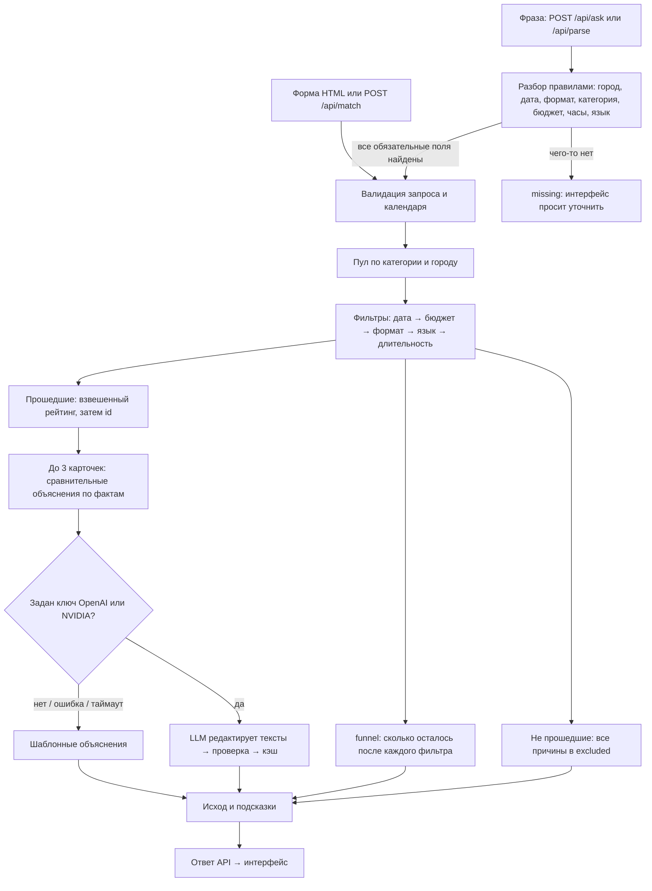

# Beyonder — умный подбор подрядчиков

До трёх event-подрядчиков под город, дату, формат и бюджет — и у каждого своё
объяснение, почему он подходит. Если подходящих нет, сервис говорит, что именно
помешало и что изменить. Запрос можно задать формой или одной фразой:
«Нужен ведущий на казахскую свадьбу 14 ноября в Алматы, бюджет до 800 тысяч, часов на 6».

**Проверяемый пример.** Алматы · фотограф · свадьба · 10 октября 2026 · бюджет 800 000 ₸ →
три варианта, у каждого своё объяснение. Меняем **только дату** на 12 декабря → остаётся один,
а прежние трое отмечены причиной «занят 12 декабря». «План Б» подскажет ближайшие даты,
где снова есть три варианта: 13 декабря (вс), 7 декабря (пн). Так видно, что календарь
действительно участвует в решении, а не только сортировка.


> [!NOTE]
> **Ключ API не нужен.** Без ключа всё работает полностью: подбор, рейтинг, «План Б», разбор фразы,
> а объяснения собираются по данным каталога (метка «Объяснение по данным»). Все ожидаемые результаты
> ниже приведены для запуска **без ключа**. С ключом OpenAI или NVIDIA модель дополнительно редактирует
> текст объяснений (метка «AI-объяснение») — это необязательно, см. [AI-объяснения с ключом](#необязательно-ai-объяснения-с-ключом).

> [!TIP]
> **Проверка за 2 минуты.** Нужны Git и Python 3.10+. Windows PowerShell:
> ```powershell
> git clone https://github.com/BAITC-Hacks/hack-774a9321-beyonder.git; cd hack-774a9321-beyonder
> py -3 -m venv .venv; .\.venv\Scripts\python.exe -m pip install -r requirements.txt
> .\.venv\Scripts\python.exe -m uvicorn app.main:app --host 127.0.0.1 --port 8000
> ```
> macOS / Linux:
> ```bash
> git clone https://github.com/BAITC-Hacks/hack-774a9321-beyonder.git && cd hack-774a9321-beyonder
> python3 -m venv .venv && .venv/bin/python -m pip install -r requirements.txt
> .venv/bin/python -m uvicorn app.main:app --host 127.0.0.1 --port 8000
> ```
> Откройте http://localhost:8000 и нажмите «Фотографы в Алматы». Во втором терминале из папки проекта:
> `.\.venv\Scripts\python.exe scripts/demo.py` (macOS/Linux: `.venv/bin/python scripts/demo.py`) → `PASS: 8 ответов, 0 ошибок`.

## Описание решения и назначение

Проект трека 06 «Креативные индустрии», задача «Умный подбор подрядчиков» (#79-lite).
Заказчик задаёт город, дату, формат мероприятия, категорию и бюджет в тенге;
при необходимости — длительность и язык. Сервис возвращает до трёх подрядчиков
с индивидуальным объяснением выбора и показывает причины отказа остальным.
Если вариантов мало или нет, интерфейс объясняет, какое условие мешает подбору,
и подсказывает, что можно изменить (ближайшая свободная дата, нужный бюджет).
Запрос можно ввести и свободным текстом: «Нужен ведущий на свадьбу 14 ноября в Алматы,
бюджет до 800 тысяч, часов на 6».

Каталог организаторов: `data/hackathon-dataset-anonymized.csv`, 66 профилей.
Имена анонимизированы. Признак `synthetic` отмечает синтетические профили;
`price_imputed` и `city_imputed` — оценочную цену и восстановленный город.
Это демонстрационный подбор, а не бронирование: цена указана «от», доступность
берётся из предоставленного календаря, а не проверяется у реального подрядчика.
Календарь: **23 сентября — 31 декабря 2026 включительно**.

### Соответствие Definition of Done

| Требование задачи | Как проверить | Где проверяется автоматически |
| --- | --- | --- |
| До 3 карточек: имя, категория, город, цена и 1–2 предложения объяснения | Шаг 2–3 проверки ниже | `scripts/demo.py` (`dense`), `tests/test_dod.py` |
| Объяснения не взаимозаменяемы: без имён карточки не перепутать | Сравнить три карточки фотографов | `test_explanations_remain_distinct_without_names`, `scripts/audit_explanations.py --strict` (7290 запросов, 0 нарушений) |
| Занятый на дату подрядчик не попадает в выдачу | Любой запрос; причина «занят …» в «Не попали» | `test_busy_contractors_never_shown` |
| Тот же запрос → тот же порядок | Повторить подбор | `test_determinism_and_card_contract` |
| Две даты → разная выдача, видно, что дело в занятости | Кнопка «Сравнить даты» (10.10 и 12.12.2026) | `test_two_dates_change_results_with_busy_reason`, `demo.py` (`december`) |
| Меньше трёх → показать сколько есть и почему | Кнопка «Редкая категория» (Флорист) | `test_rare_category_explains_partial_result`, `demo.py` (`rare`) |
| Три исхода различимы: подобрали / нет категории в городе / кандидаты есть, но не проходят | Кнопки «Фотографы в Алматы», «Нет в городе»; бюджет 1 ₸ | `test_outcomes`, `demo.py` (`no-category`, `none`) |
| Пустой результат объяснён словами | Бюджет 1 ₸ → причины и «при бюджете от…» | `demo.py` (`none`) |
| Ответ за разумное время (ориентир до 10 с) | Время ответа выводится над подборкой («ответ за 0,009 с»); LLM-слой ограничен 6 с | `tests/test_explain_llm.py` (таймаут), аудит (время на 7290 запросах) |
| Команда может объяснить пайплайн | Схема и формула рейтинга ниже, воронка в ответе | `test_funnel_is_sequential_and_preserves_rejection_reasons` |

## Архитектура



- `app/data.py` загружает CSV; необязательный `data/synthetic-extra.csv` добавляет
  профили команды (`synthetic=true`, поле `source` отличает их от данных организаторов).
- `app/matcher.py` проверяет жёсткие ограничения. Сохраняются **все** причины
  исключения: кандидат может одновременно быть занят и превышать бюджет,
  поэтому сумма счётчиков причин может превышать размер пула. Поле `funnel`
  показывает последовательную воронку: пул → свободны на дату → бюджет → формат → язык → длительность.
- Рейтинг прошедших: `0.40 × budget + 0.30 × relevance + 0.15 × hours +
  0.10 × language + 0.05 × data_quality`. `budget` — запас бюджета относительно
  цены; `relevance` — маркеры формата в описании и узкая специализация; `hours` —
  запас длительности; `language` — соответствие языку или разнообразие языков;
  `data_quality` снижает оценку при восстановленных цене/городе.
  Итог округляется до 6 знаков и сортируется по убыванию; равенство разрешается
  по `id` по возрастанию. Выдаются первые три.
- Объяснения сравнительные: код считает, чем карточка отличается от остальных в подборке
  (цена, часы на площадке, языки, форматы, фрагмент описания, занятость категории на дату).
  Поэтому карточки одного запроса нельзя перепутать даже без имён.
- `app/explain_llm.py` — необязательная редактура объяснений через OpenAI или NVIDIA API (см. ниже).
- `app/nl_parse.py` — разбор запроса свободным текстом по правилам, без сети.
- `app/alternatives.py` — «План Б»: для дат ±14 дней прогоняет те же фильтры и рейтинг
  и предлагает ближайшие даты с большей подборкой.
- `app/main.py` предоставляет API и страницу `static/index.html`. БД, сборщик
  фронтенда и Node.js не нужны.

| Исход | Значение |
| --- | --- |
| `found` | Найдено не менее 3 подходящих, показаны 3 лучших |
| `partial` | Подходят 1–2 подрядчика, в `message` — почему меньше трёх |
| `no_category_in_city` | В городе вообще нет выбранной категории |
| `none_match` | Категория есть, но все кандидаты исключены по условиям |
| `invalid_request` | Дата вне известного календаря |

Некорректные типы полей, неположительный бюджет и неизвестные формат/язык дают
HTTP 422 с `detail`. Это отдельный ответ валидации, а не `none_match`.

Кроме карточек, ответ `/api/match` содержит `funnel` — последовательное сужение пула
(например, «8 в категории и городе → 4 свободны 10 октября → 4 в бюджете → 3 берут формат»),
`excluded` — все причины отказа по каждому кандидату и `hints` — что изменить, чтобы нашлось
(«ближайший свободный день…», «при бюджете от…»). У карточки `highlights` — короткие отличия
(«Дороже самого доступного на 50 000 ₸», «До 12 ч — дольше остальных»), `score_parts` — вклад
каждого фактора в рейтинг, `explanation_source` показывает, как собрано объяснение: `template` — по правилам из фактов профиля, `llm` — отредактировано моделью
после проверки фактов.

### API

| Метод | Вход | Выход |
| --- | --- | --- |
| `GET /api/meta` | — | Допустимые города, категории, форматы, языки и границы календаря |
| `POST /api/match` | город, дата, формат, категория, бюджет, опц. часы и язык | `outcome`, `message`, `cards` (с `highlights`, `score_parts`, `explanation_source`), `excluded`, `hints`, `funnel` |
| `POST /api/parse` | `{"text": "..."}` | `params` (поля запроса, `null` если не найдено), `found` (поле, значение, фрагмент текста), `missing`, `notes`, `source` |
| `POST /api/ask` | `{"text": "..."}` | `parsed` (как выше) и `result` — ответ `/api/match` или `null`, если не хватает обязательных полей |
| `POST /api/alternatives` | те же поля, что у `/api/match` | `base` (сколько подходит на выбранную дату), `options` (ближайшие даты: день недели, выходной, сколько проходит, топ), `message` |

Интерактивная документация: `http://localhost:8000/docs`.

### «План Б»: другие даты

`POST /api/alternatives` проверяет даты в пределах ±14 дней теми же фильтрами и рейтингом,
что `/api/match`, и сначала показывает ближайшие даты с полной подборкой. Для фотографов
в Алматы на 12 декабря (подходит 1): «13 декабря (вс) — 3 варианта; 7 декабря (пн) — 3 варианта…».
Если мешает не дата, а бюджет, формат, язык или часы, ответ прямо говорит, что смена даты
не поможет, и называет причину. Тест сверяет: предложенная дата даёт в `/api/match` ту же тройку.

## Используемые технологии

Python 3.10+, FastAPI, Pydantic, Uvicorn; OpenAI Python SDK (необязательный слой
объяснений); pytest и httpx для тестов; HTML, CSS и JavaScript без фреймворков.
Данные — CSV; API — JSON.

## Инструкции по установке

```bash
git clone https://github.com/BAITC-Hacks/hack-774a9321-beyonder.git
cd hack-774a9321-beyonder
```

Windows PowerShell (Python 3.10+ с установщика python.org доступен как `py`; если команды `py` нет — используйте `python -m venv .venv`):

```powershell
py -3 -m venv .venv
.\.venv\Scripts\python.exe -m pip install -r requirements.txt
```

macOS / Linux (проверьте `python3 --version` — нужен 3.10 или новее):

```bash
python3 -m venv .venv
.venv/bin/python -m pip install -r requirements.txt
```

Активация окружения не требуется. Команды выполняются из корня репозитория.

## Инструкции по запуску

Windows PowerShell:

```powershell
.\.venv\Scripts\python.exe -m uvicorn app.main:app --host 127.0.0.1 --port 8000
```

macOS / Linux:

```bash
.venv/bin/python -m uvicorn app.main:app --host 127.0.0.1 --port 8000
```

Открыть [интерфейс](http://localhost:8000), [Swagger](http://localhost:8000/docs)
или [метаданные](http://localhost:8000/api/meta). Остановка — `Ctrl+C`.
Если порт занят, используйте `--port 8001`; демо принимает `--base-url http://127.0.0.1:8001`.
Не открывайте HTML через `file://`: ему нужен API. API-ключ для запуска не требуется
(AI-объяснения с ключом — [необязательный раздел](#необязательно-ai-объяснения-с-ключом)).

## Зависимости

Все зависимости перечислены в `requirements.txt`: `fastapi`, `uvicorn` — сервис;
`openai` — необязательный LLM-слой (импортируется только при обращении к модели);
`python-dotenv` — чтение `.env` через `--env-file`; `pytest`, `httpx` — тесты.
Интернет нужен для установки; затем подбор работает локально, сеть нужна только LLM-слою.

## Переменные окружения

Все переменные необязательны: без них сервис полностью работает на шаблонных объяснениях.

| Переменная | По умолчанию | Назначение |
| --- | --- | --- |
| `LLM_PROVIDER` | `openai` | Провайдер редактуры объяснений: `openai` или `nvidia`; другое значение — только шаблоны |
| `OPENAI_API_KEY` | пусто | Ключ OpenAI для редактуры объяснений. Берётся на platform.openai.com → API keys |
| `OPENAI_MODEL` | `gpt-4o-mini` | Модель с поддержкой `temperature=0` и Structured Outputs |
| `NVIDIA_API_KEY` | пусто | Ключ NVIDIA API Catalog (build.nvidia.com), нужен при `LLM_PROVIDER=nvidia` |
| `NVIDIA_MODEL` | пусто (в `.env.example` — `meta/llama-3.3-70b-instruct`) | Модель через OpenAI-совместимый endpoint `https://integrate.api.nvidia.com/v1`; без модели — шаблоны |
| `EXPLANATIONS_LLM_ENABLED` | `true` | `false` полностью выключает обращения к API |
| `LLM_DEBUG` | `0` | `1` печатает в консоль сервера, почему ответ LLM отклонён проверкой (ключ не выводится) |

Ключ хранится только в окружении или локальном `.env`, который исключён из Git.
Не включайте ключ в Git или клиентский HTML.

### Как устроен LLM-слой объяснений

Один вызов обрабатывает все карточки запроса. Модель получает только условия запроса,
проверяемые факты, релевантные цитаты и уже рассчитанные кодом сравнения; она возвращает
JSON с массивом объяснений и не влияет на отбор или порядок. Ответ проверяется:
1–2 предложения, стоп-лист общих фраз, наличие числового или цитатного основания,
отсутствие чисел и цитат, которых нет во входе, различимость карточек без имён.
При нарушении допускается одна попытка исправления с перечнем ошибок; на обе попытки
вместе выделено 6 секунд. Нет ключа, ошибка, таймаут или повторный невалидный ответ —
используются шаблоны. В каждой карточке есть `explanation_source`: `llm` либо `template`.

Кэш — `.cache/explanations.json`, ключ SHA-256 от запроса, упорядоченных ID и версии
промпта: одинаковый запрос всегда возвращает тот же текст. Чтобы заново запросить LLM
после временной ошибки, удалите файл и перезапустите приложение. Для демонстрации
используйте один процесс uvicorn.

### Запрос свободным текстом

`POST /api/parse` распознаёт город, дату («14 ноября», «14.11», «2026-11-14»), формат,
категорию (включая синонимы: «тамада», «фотобудка», «живая музыка»), бюджет («800 тысяч»,
«1,5 млн», «600к», «400 000 ₸»), длительность и язык. Для каждого поля возвращается фрагмент
текста, из которого оно взято (`found`); нераспознанные обязательные поля — в `missing`;
вторая категория в тексте и дата вне календаря объясняются в `notes`. Разбор детерминирован
и работает без сети.

## Порядок проверки основного сценария

1. Запустить сервер и открыть `http://localhost:8000`.
2. Нажать кнопку-сценарий **«Фотографы в Алматы»** (или вручную: **Алматы / 10.10.2026 / свадьба /
   Фотограф / 800000 ₸**, длительность пустая, язык любой → «Подобрать подрядчиков»).
3. Ожидается `found`: три карточки с одинаковой структурой фактов (цена и % бюджета, свободен,
   часы, языки), строкой «Чем выделяется» и объяснением «Почему этот подрядчик»; раскрывающийся
   блок «Как посчитан рейтинг» показывает вклад каждого фактора; рядом с заголовком — время ответа.
   Без ключа у карточек метка «Объяснение по данным».
   Исключённые кандидаты — в «Не попали — почему». Кнопки «Редкая категория» и «Нет в городе»
   показывают исходы `partial` и `no_category_in_city`.
4. Кнопка **«Сравнить даты»** (или поле «Другая дата» = **12.12.2026** → «Сравнить с другой датой»):
   подборки отображаются рядом, кандидаты из октябрьской выдачи подсвечены как исключённые
   с причиной «занят 12 декабря» (подсветка строится по причинам в `excluded`).
   Под декабрьской подборкой — блок **«Другие даты»** («План Б»): «13 декабря (вс) — 3 варианта»,
   «7 декабря (пн) — 3 варианта»; клик ставит дату и повторяет подбор. При бюджете 1 ₸ блок честно
   пишет «Дело не в дате… смена даты не поможет». То же через API (во втором терминале):

```powershell
.\.venv\Scripts\python.exe scripts/demo.py --case plan-b
```

```bash
.venv/bin/python scripts/demo.py --case plan-b
```
5. Запрос свободным текстом: в поле «Опишите мероприятие своими словами» ввести
   «Нужен ведущий на казахскую свадьбу 14 ноября в Алматы, бюджет до 800 тысяч, часов на 6»
   и нажать «Разобрать». Форма заполняется, под полем видно, из какого фрагмента текста взято
   каждое значение, и подсказка про язык «казахский» и формат «той». Подбор сам не запускается:
   проверьте распознанные поля и нажмите «Подобрать подрядчиков». Под результатом у подсказок
   «ближайший свободный день…» и «при бюджете от…» есть кнопка «Применить» — она подставляет
   дату или бюджет и повторяет подбор. То же через API (сценарий `nl` в `scripts/demo.py`):

```powershell
.\.venv\Scripts\python.exe scripts/demo.py --case nl
```

```bash
.venv/bin/python scripts/demo.py --case nl
```

Ожидается: распознаны город, дата 2026-11-14, свадьба, Ведущий, 800 000 ₸ и 6 ч — каждое поле
с фрагментом текста; уточнение про «казахский» и «той»; `partial`, карточка — Мицури Канроджи (HK-44923).
Клиент на Python печатает ответ одинаково на Windows, macOS и Linux; API отдаёт
`application/json; charset=utf-8`, поэтому `Invoke-RestMethod` тоже показывает кириллицу корректно.

6. Прогнать все демо-сценарии в другом терминале, пока сервер работает:

```powershell
.\.venv\Scripts\python.exe scripts/demo.py
```

```bash
.venv/bin/python scripts/demo.py
```

Успех — `PASS: 8 ответов, 0 ошибок`
и код завершения 0; несовпадение исходов или недоступность API — ненулевой код.
Клиент печатает запросы, сообщения, карточки, объяснения и причины исключения.
Подробные входы, ID и фактические ответы: [docs/DEMO.md](docs/DEMO.md).

7. Автотесты требований (Definition of Done) — без сети, LLM-тесты подменяют SDK:
детерминизм порядка, занятые никогда не показываются, разная выдача на две даты с причиной
«занят», различимые исходы, редкая категория, границы календаря, объяснения различимы без имён,
последовательная воронка, HTTP-контракт, LLM-слой (кэш, проверка, таймаут) и разбор свободного текста.

```powershell
.\.venv\Scripts\python.exe -m pytest -q
```

```bash
.venv/bin/python -m pytest -q
```

Ожидается: все тесты проходят (`pytest` уже входит в `requirements.txt`).

8. Аудит объяснений на всей сетке запросов (город × категория × формат × дата каждые 7 дней × 3 бюджета),
   без сети и без LLM: карточки одного запроса не совпадают ни целиком, ни первым предложением,
   ни после удаления имени и номера профиля; нет общих фраз; не больше двух предложений.

```powershell
.\.venv\Scripts\python.exe scripts/audit_explanations.py --strict
```

```bash
.venv/bin/python scripts/audit_explanations.py --strict
```

Ожидается: «Запросов: 7290 … Нарушений не найдено.» и код завершения 0.

## Необязательно: AI-объяснения с ключом

Для проверки решения ключ не нужен. С ключом модель редактирует текст объяснений по проверенным фактам;
отбор, порядок карточек и все исходы остаются теми же.

1. Создать `.env` из примера и вписать ключ (`OPENAI_API_KEY=…`; для NVIDIA — `LLM_PROVIDER=nvidia`,
   `NVIDIA_API_KEY`, `NVIDIA_MODEL`). Файл `.env` исключён из Git.

```powershell
Copy-Item .env.example .env
```

```bash
cp .env.example .env
```

2. Запустить сервер с этим файлом:

```powershell
.\.venv\Scripts\python.exe -m uvicorn app.main:app --host 127.0.0.1 --port 8000 --env-file .env
```

```bash
.venv/bin/python -m uvicorn app.main:app --host 127.0.0.1 --port 8000 --env-file .env
```

3. Прогреть кэш — во втором терминале прогнать демо-сценарии:

```powershell
.\.venv\Scripts\python.exe scripts/demo.py
```

```bash
.venv/bin/python scripts/demo.py
```

   Ожидается `PASS: 8 ответов, 0 ошибок` и в выводе `Источник объяснения: llm`. Ответы модели
   сохраняются в `.cache/explanations.json` и переживают перезапуск сервера: кнопки-сценарии,
   сравнение дат и пример с фразой затем отвечают из кэша. Запросы, которых не было при прогреве
   (например, «Применить» или «Другие даты»), обращаются к модели на лету — до 6 с.
4. В интерфейсе у карточек появится метка «AI-объяснение». Если модель недоступна, не уложилась в 6 с
   или ответ не прошёл проверку фактов — остаётся «Объяснение по данным». Причины отклонения видны
   в консоли сервера при `LLM_DEBUG=1` в `.env`.

## Почему так устроено

- **Решение принимает детерминированный алгоритм** (фильтры и рейтинг): задание требует «тот же запрос —
  тот же порядок». LLM используется там, где он безопасен: переписывает объяснения из уже проверенных
  фактов; валидатор отклоняет выдуманные числа, цитаты и общие фразы, при отказе остаются объяснения по данным.
- **Вес бюджета 0.40:** цена в каталоге указана «от», поэтому запас бюджета снижает риск выйти за него.
  Все веса видны в карточке — «Как посчитан рейтинг».
- **Смысл описания** учитывается через маркеры формата в описании (фактор «описание и формат», 30%)
  и дословные цитаты в объяснениях. Семантический поиск по эмбеддингам — следующий шаг, см. «Масштабирование».

## Что сделано иначе

Только то, что есть в коде и проверяется тестами или демо-сценарием.

| Решение | Зачем | Чем подтверждается |
| --- | --- | --- |
| Сравнительные объяснения: карточка говорит, чем подрядчик отличается от двух других в этой же подборке | Помочь выбрать, а не перечислить достоинства | `test_explanations_remain_distinct_without_names` |
| Причина исчезновения при смене даты доказана, а не угадана: «занят 12 декабря» берётся из причин отказа | Видно, что календарь влияет на решение | `test_two_dates_change_results_with_busy_reason`, `demo.py` (`december`) |
| Все причины отказа по каждому кандидату и последовательная воронка отбора | Честный ответ «почему мало» вместо пустого экрана | `test_funnel_is_sequential_and_preserves_rejection_reasons` |
| Подсказки с действием: «ближайший свободный день…», «при бюджете от…» → «Применить» | Следующий шаг в один клик | `_hints` в `app/matcher.py`, интерфейс |
| «План Б»: блок «Другие даты» с ближайшими датами, где подборка больше, или прямое «смена даты не поможет» | Ценность, когда на выбранную дату почти никого | `test_offered_date_really_gives_that_selection_in_main_match`, `test_when_date_is_not_the_problem_it_says_so_with_reasons` |
| Фраза → форма: каждое поле показано вместе с фрагментом текста; отрицания, отрицательный бюджет и диапазон разбираются явно; подбор запускает пользователь | Быстрый ввод без «чёрного ящика» | `tests/test_nl_parse.py` (в т. ч. `test_every_found_field_has_source_fragment`, `test_negated_language_is_not_selected_and_is_explained`) |
| LLM только редактирует текст готовых фактов: не влияет на отбор и порядок, ответ проверяется на выдуманные числа и цитаты, есть кэш и откат на шаблоны | Детерминизм и отсутствие галлюцинаций | `test_match_marks_llm_source_without_changing_order`, `test_validator_rejects_ungrounded_or_generic_text`, `test_total_timeout_includes_validation_retry` |
| Синтетические профили и восстановленные цена/город помечены в выдаче | Не выдавать допущения за факты | бейджи в интерфейсе, поля карточки `synthetic`, `price_imputed`, `city_imputed` |
| Прозрачный рейтинг: «Как посчитан рейтинг» показывает вклад бюджета, описания, часов, языка и качества данных с весами | Жюри и пользователь видят, почему порядок именно такой; рейтинг не выдаётся за вероятность | `score_parts` в карточке, интерфейс |
| Аудит качества объяснений на всей сетке запросов, а не на трёх примерах | Требование «не взаимозаменяемы» проверено на 7290 запросах, 0 нарушений | `scripts/audit_explanations.py --strict` |

## Ограничения

Календарь известен только с 23.09 по 31.12.2026; цена «от» не является окончательной
сметой. Бронирование и уведомления не реализованы. Качество перефразирования зависит от
модели; локальная проверка фактов не заменяет полную семантическую проверку текста.
У полностью одинаковых по условиям профилей отличия в услугах не выдумываются.
Разбор свободного текста работает по правилам: поддерживается один язык, редкие формулировки
могут не распознаться — тогда поле попадает в `missing`, и пользователь заполняет его в форме.

## Масштабирование и развитие

Планы, а не реализованные функции:

- **Живые календари.** Заменить CSV на синхронизацию занятости с подрядчиками (API или календари);
  фильтры, рейтинг и «План Б» уже работают с датами и не требуют изменений.
- **Больше городов и категорий.** Каталог загружается из данных, города и категории берутся из `/api/meta`;
  при росте каталога — перейти с CSV на базу данных с индексом по городу, категории и дате.
- **Семантический поиск по описаниям.** Эмбеддинги описаний, чтобы находить подрядчиков по смыслу запроса
  («камерная свадьба на природе»), а не только по маркерам формата.
- **Обратная связь.** Отметки «подошло / не подошло» для настройки весов рейтинга на реальных выборах.
- **Встраивание.** API без состояния: подбор можно встроить виджетом на сайт агрегатора или площадки.
- **Языки.** Интерфейс на казахском; разбор текста уже понимает казахские формулировки формата («той»).

## Команда

| Участник | Роль |
| --- | --- |
| [@Nurzhan-Zhumabekov](https://github.com/Nurzhan-Zhumabekov) | Backend: подбор, объяснения и LLM-слой, разбор текста, «План Б», тесты; координация |
| [@Dossm04](https://github.com/Dossm04) | Интерфейс, демо-сценарии, документация и проверка воспроизводимости |
